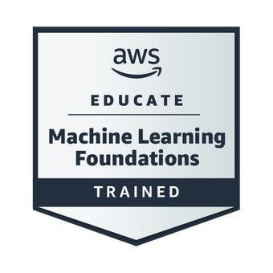

<h2 align="center">🚀 About Me</h2>

  I am a Computer Science student at the University of Padua with a strong interest in software development and modern technologies. Through my academic journey and hands-on internship experience, I have developed practical skills in mobile application development, API integration, and data management.  
  I enjoy working on real-world problems, focusing on building efficient and reliable solutions while continuously improving my technical abilities. With a solid foundation in algorithms, systems, and networking, I am motivated to grow as a developer and contribute to innovative and impactful projects.

 

<h2 align="center">🧠 Main Skills</h2>

  

 

<h2 align="center">🎓 Certifications</h2>

  <table>
    <tr>
      <td align="center">
        
      </td>
      <td align="center">
        
      </td>
    </tr>
    <tr>
      <td align="center">
        <em>Networking fundamentals, IP addressing, protocols, network configuration</em>
      </td>
      <td align="center">
        <em>Machine learning fundamentals, data analysis, model training, AI concepts, AWS cloud tools</em>
      </td>
    </tr>
  </table>

